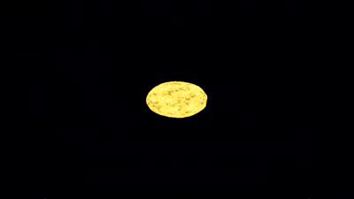

# Laboratorio 5 - Estrella Animada - Milton Polanco 23471

## Descripción
Este proyecto simula una estrella tipo sol con actividad en su superficie. Utilicé shaders procedurales para generar la apariencia y animación sin usar texturas.

## Demostración


## Implementación

### Ruido Procedural
**OpenSimplex2**

### Fragment Shader
Combino 3 capas de ruido con diferentes frecuencias:

**Ruido Base (escala 2.2x):** Define regiones grandes de temperatura con movimiento lento.

**Ruido de Detalle (escala 5.0x):** Añade turbulencia media para variación.

**Manchas Solares (escala 9.0x):** Alta frecuencia para simular manchas oscuras.

### Mapeo de Temperatura a Color
Los valores de ruido se convierten en temperatura, y esta determina el color:

- Mayor a 0.88: Blanco puro
- 0.75 - 0.88: Blanco amarillento
- 0.61 - 0.75: Amarillo brillante
- 0.47 - 0.61: Amarillo naranja
- 0.34 - 0.47: Naranja intenso
- 0.22 - 0.34: Naranja rojizo
- Menor a 0.22: Rojo oscuro (manchas solares)

### Emisión Variable
Las zonas más calientes emiten más luz para simular picos de energía:

- Zonas calientes (temperatura mayor a 0.75): 1.5x emisión
- Zonas medias (0.35 - 0.75): 0.9x - 1.15x emisión
- Manchas frías (menor a 0.35): 0.65x emisión

## Controles
- W/S: Acercar/Alejar cámara
- A/D: Rotar horizontalmente
- Q/E: Rotar verticalmente  
- ESC: Salir

## Ejecución
```bash
# Compilar y ejecutar
cargo run --release
```

## Especificaciones Técnicas

### Rendimiento
- Resolución: 800x600
- FPS objetivo: 60
- Triángulos: 320 (esfera suave)
- Distancia mínima: 85 unidades
- Distancia máxima: 200 unidades

### Tecnologías
- **Rust** - Lenguaje de programación
- **nalgebra-glm** - Matemáticas 3D y transformaciones
- **fastnoise-lite** - Generación de ruido procedural
- **minifb** - Ventana y framebuffer
- **tobj** - Cargador de modelos OBJ

## Estructura del Proyecto
```
Lab5/
├── src/
│   ├── main.rs          - Loop principal y configuración
│   ├── shaders.rs       - Vertex y Fragment shaders
│   ├── camera.rs        - Sistema de cámara orbital
│   ├── framebuffer.rs   - Buffer de píxeles y z-buffer
│   ├── triangle.rs      - Rasterización de triángulos
│   ├── vertex.rs        - Estructura de vértices
│   ├── fragment.rs      - Estructura de fragmentos
│   ├── color.rs         - Utilidades de color
│   └── obj.rs           - Cargador de modelos OBJ
├── assets/
│   └── sphere.obj       - Modelo de esfera base
└── Cargo.toml
```